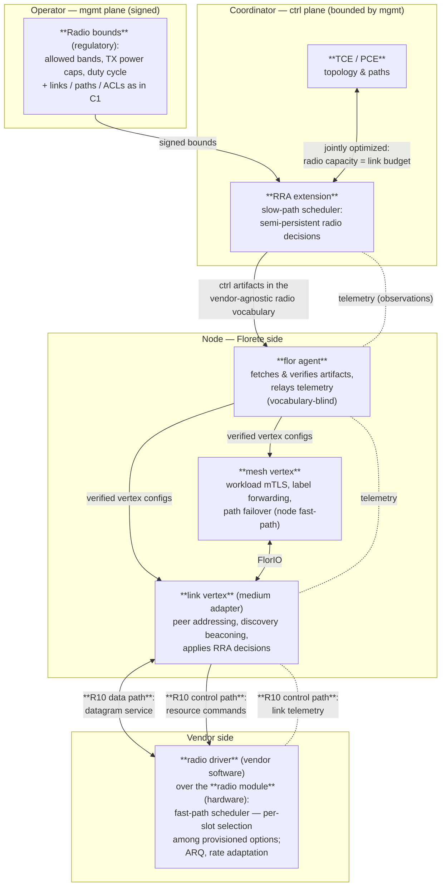

B2 weaves three threads: the C1 data plane running over real radio, the first Coordinator [RRA](../glossary#rra) extension, and a vendor boundary crisp enough to hand to a radio maker (the [Link Contract](../link-contract)). This page is the map; the other pages are the territory. Suggested reading order: [Scope](../scope) → this page → [Link Contract](../link-contract) → [Radio MACs](../radio-macs) → [Experiments](../experiments), with the [Glossary](../glossary) as reference.

<Callout title="Requirement numbering">
The Link Contract is a catalog of numbered requirements, **R1–R10** (see its [requirements tables](../link-contract#requirements)). This page refers to them by number: **R1–R7** form the data-plane link contract, **R8–R9** the ctrl-plane resource contract, and **R10** is their envelope — the host interface (below).
</Callout>

## The full stack

The two contracts are two cuts through this picture:

- The **data-plane link contract (R1–R7)** is what crosses **R10's data path**: the per-neighbor datagram service and its properties — residual loss, MTU, liveness, discovery.
- The **ctrl-plane resource contract (R8–R9)** is the decision/telemetry loop crossing **R10's control path**: semi-persistent decisions travel RRA → agent → link vertex → radio driver; telemetry travels the same chain in reverse (the dashed edges).
- **R10 is not a third contract — it is the envelope**: the one concrete, negotiated host interface through which the medium-side obligations of both contracts are delivered. Its data path carries R1's service (with R2/R4 as that service's properties); its control path carries telemetry (R5), discovery primitives (R6), and resource commands (R8–R9).

## Who speaks which vocabulary

The vendor-agnostic/vendor-specific split is not just an R10 concern — it runs through the whole artifact chain. B2's rule:

| Component | Radio vocabulary it understands |
|---|---|
| Operator YAML (mgmt) | **Vendor-agnostic** radio bounds: bands, power caps, duty cycle |
| Coordinator RRA | **Vendor-agnostic** — produces radio ctrl artifacts in the shared resource vocabulary |
| Distribution + `flor agent` | **None** — envelopes and signatures only; the agent parses no payload but its own (the C0 [layering rule](/docs/implementation/c0-tended-tunnels/mgmt-plane/agent#supervision-contract), unchanged) |
| Mesh vertex | **None** — sees links and adapters, never radios |
| Link vertex (its [medium adapter](../glossary#medium-adapter)) | **Both** — consumes the vendor-agnostic vocabulary, translates it into vendor-specific R10 commands |
| Radio driver / module (vendor) | **Vendor-specific only** — no Florete knowledge |

So the **ctrl-plane resource contract is the vendor-agnostic radio vocabulary shared by exactly two parties** — the Coordinator's RRA and the link vertex's medium adapter. **R10 is where translation to vendor-specific happens.** Everything in between (distribution, agent, envelopes, signatures) is vocabulary-blind and needs no changes for a new radio: integrating one is a new medium adapter plus an R10 binding, never new artifact machinery.

B2's reference instantiation (WiFi): the RRA emits per-node TX-power caps in the shared vocabulary; the WiFi medium adapter translates them into nl80211 calls; telemetry (RSSI, rate, retries) flows back up the same path.

## B2 walk-through

How the pieces exercise each other in the reference prototype:

1. **Joining.** A node comes into radio range → discovery beaconing over the medium ([Link identity & discovery](../link-contract#link-identity--discovery)) → mesh-vertex mTLS over the new link. Both ends must already be **enrolled**: B2 admission stays operator-driven — discovery *finds* enrolled peers, it never admits unknown ones.
2. **Steady state.** The mesh forwards across mixed WiFi + Ethernet hops; per-link telemetry flows to the Coordinator; the RRA revises power caps at ctrl timescale, TCE/PCE revise topology and paths against the same link budgets.
3. **Degradation.** The radio link worsens → BFD-class liveness (R7) trips → the mesh-vertex fails over to an allowed alternative path (node fast-path, within its ctrl bounds) → the Coordinator re-plans at its own timescale.

## Open questions

- The vendor-agnostic vocabulary itself — grown feature-by-feature from B2's minimal CSMA RRA (power caps first), same discipline as the bounds language.
- Whether ctrl artifacts may carry an **opaque vendor-specific extension** passed through to the medium adapter — and how operator-signed bounds apply to content Florete cannot interpret (fail-closed by default?).
- Slow-path scheduler ownership for vendor-supplied planners — see [Radio MACs](../radio-macs#no-infrastructure-asymmetry).
- Per-page open questions live with their topics: [Link Contract](../link-contract#open-questions), [Radio MACs](../radio-macs#open-questions).
