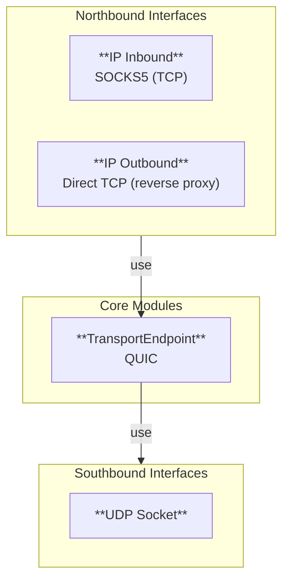

import { Accordion, Accordions } from 'fumadocs-ui/components/accordion';

This document is created as a subset of [Data Plane for C1. Manual Mesh](../../c1-manual-mesh/design/).

## Design Sketch

**Proposal**: 
Implement single executable called `flor` with following modules:
- IP Inbound: SOCKS5 for TCP
- IP Outbound: direct TCP (reverse proxy)
- TransportEndpoint: QUIC, provides connections for clients
- UDP socket: star topology forwarding
