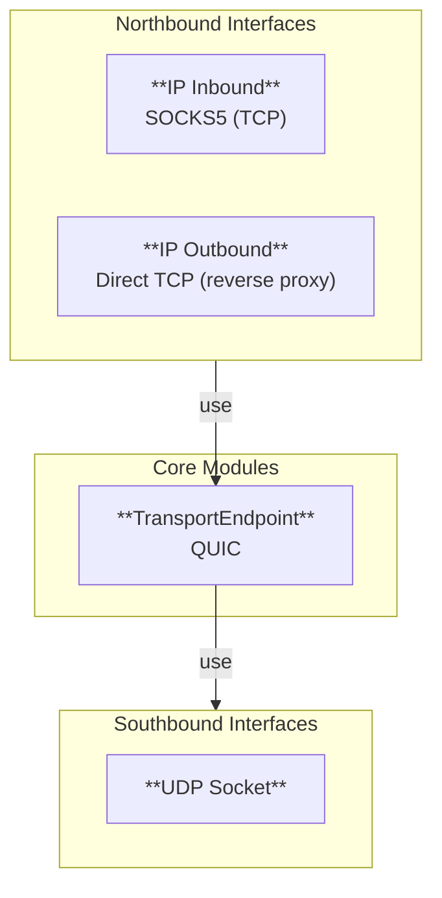

import { Accordion, Accordions } from 'fumadocs-ui/components/accordion';

This document is created as a subset of [Data Plane for C1. Manual Mesh](../../c1-manual-mesh/data-plane/).

## Design Sketch


```mermaid
graph TD
    subgraph Northbound [Northbound Interfaces]
        IP_Inbound["**IP Inbound**\nSOCKS5 (TCP)"]
        IP_Outbound["**IP Outbound**\nDirect TCP (reverse proxy)"]
    end

    subgraph Core [Core Modules]
        TransportEndpoint["**TransportEndpoint**\nQUIC"]
    end

    subgraph Southbound [Southbound Interfaces]
        UDP_SB["**UDP Socket**"]
    end

    %% Relationships
    Northbound -->|use| TransportEndpoint
    TransportEndpoint -->|use| Southbound
```

**Proposal**:<br/>
Implement single executable called `flor` with following modules:
- IP Inbound: SOCKS5 for TCP
- IP Outbound: direct TCP (reverse proxy)
- TransportEndpoint: QUIC, provides connections for clients
- UDP socket: star topology forwarding

## Targets and the wire label

A connection's target is a principal of a targetable kind — a service or a vertex ([ID-C0-15](/docs/implementation/c0-tended-tunnels/mgmt-plane/identity#decision-log)). The transport endpoint takes one kind of target, through one connect, whichever path the connection enters by:

- **legacy** — the SOCKS5 inbound receives a `.rete` hostname, resolves it against the caller's trust domain to a service ([ID-C0-14](/docs/implementation/c0-tended-tunnels/mgmt-plane/identity#decision-log)), and connects to that service;
- **native** — a FlorIO caller names its target by identity.

Neither path puts a hostname on the wire. The endpoint derives the TLS server name (SNI) from the target alone, as a kind marker, a scope marker, the name, the node where there is one, the trust domain and `.rete`:

```
svc.rete.<service>.<td>.rete           rete-scoped service   svc.rete.api.flor.demo.rete
svc.node.<service>.<node>.<td>.rete    node-scoped service   svc.node.ssh.alpha.flor.demo.rete
vtx.node.<vertex>.<node>.<td>.rete     vertex                vtx.node.hop.alpha.flor.demo.rete
```

The markers fix how many labels come before the trust domain, so two identities one endpoint publishes never share a server name, even when they belong to different trust domains. The server keys the certificates it publishes by this label and matches an incoming SNI by exact lookup; it never parses an identity out of it, and it is the SAN, not the SNI, that authenticates ([ADR-0006](/docs/implementation/adr/0006-impl-mtls-in-quic-endpoint)). The label reads back from a packet capture, and an opaque form stays possible behind the same derivation ([ADR-0007](/docs/implementation/adr/0007-decouple-naming-identity-routing)). A kind that becomes targetable takes a kind marker of its own.

## Local callers

Each inbound is bound to exactly one principal, so the vertex knows who is calling from where the call arrived ([ID-C0-07](/docs/implementation/c0-tended-tunnels/mgmt-plane/identity#decision-log)). In C0 an inbound is a SOCKS5 listener on a dedicated local port per principal — a service's is its `socks5_proxy` in `services.yaml` — and an application reaches the rete with `ALL_PROXY=socks5://127.0.0.1:<port>`. Most HTTP clients, gRPC clients and database drivers honour that variable; an application that does not needs a transparent redirect or a library shim, which C0 does not build.

The other direction needs no attribution: the vertex delivers an accepted connection to the service's local address, the target having been authenticated by its SAN.

Nothing authenticates a local caller. Any process on a host can connect to any SOCKS5 inbound there and act as that inbound's principal: the binding tells callers apart by where they arrive, and nothing stops one from arriving at another's inbound.
