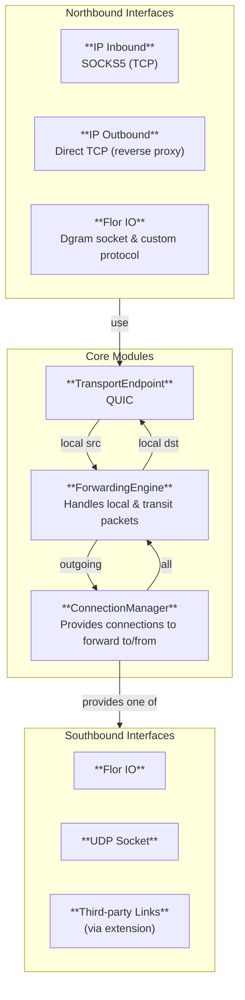

import { Accordion, Accordions } from 'fumadocs-ui/components/accordion';

## Key Challenge

Key challenge of the foundational work lies in how to represent vertices and Portal APIs between them, and how to satisfy requirement to support different link protocols easily. In our previous attempt we implemented vertices as async actors within Tokio runtime, and Portal API was actor API, channel-based, with data path (connection) implemented as a trait object. This has following drawbacks:
- Cluster vertex with QUIC endpoint for transport service needs UDP socket to work on: that's natural for any implementation because QUIC runs over UDP sockets. Moreover, almost any transport endpoint will require some sort of a datagram socket - e.g. TCP over IP, or DTLS over UDP, or WireGuard over UDP.
- Implementing a socket-like structure in a userspace properly is hard: in terms of async Rust, you need a waker to notify when sending or receiving is ready. And, as we're using quinn-rs connections with dgram service for links, we ended up with `AsyncUdpSocket` over `send_datagram`/`receive_datagram` methods of a link vertex's QUIC endpoint. The QUIC API lacks the needed waker, implementation works, but busy-waiting (`poll_send` is always ready). And fixing this probably requires rewriting/extending top-level QUIC APIs of quinn exactly for this niche use case - a task not feasible for the time being.
- What is even more important, this design of vertices as in-process actors isn't extendable really with other link protocols: it requires re-implementing them in async Rust! A task that isn't feasible either.

## New Solution

Instead of trying to implement the socket-like structure in the userspace, we can use actual kernel-provided socket! This brilliantly solves both problems:
- we get real socket structure for the cluster vertex to use
- we can separate link implementations to external processes, enabling modular design and support for virtually any link protocol

The main drawback of this new approach is performance: copying of the packet to and from userspace multiple times, context switches, calls into IP stack. Theoretically it can be solved using zero-copy buffers (AF_XDP?) and eBPF, but requires deep dive into these technologies. Non-UDP or even non-socket IPC can be adopted probably. Hopefully, we can leave this for later, performance isn't a goal for our C1 milestone.

## Design Sketch

### Problem Definition

Need to specify architecture of our solution that covers C1 scenarios and has following mandatory properties:
- Cluster vertex must use some datagram socket to communicate with link vertex
- The architecture must allow adding third party link implementations without re-implementing them in Rust
- Cross-platfrom design for Linux, Windows, MacOS, Android, iOS, and HarmonyOS
- Recursiveness: datagram socket used to communicate with link vertex should be reusable by cluster vertex users, including interrete vertex

### Accepted Design



**Terms**:
- Northbound interface: an interface for clients ("on the top" of current component)
- Southbound interface: an interface for used components ("on the bottom" of current component)
- Inbound: an interface module to serve clients that want to originate connections/packets
- Outbound: an interface module to serve clients that want to receive connections/packets


**Proposal**:<br/>
Implement single executable called `flor` with following modules:
- IP Inbound: SOCKS5 for TCP
- IP Outbound: direct TCP (reverse proxy)
- Northbound native Flor IO (Inbound/Outbound): datagram socket and custom protocol (impl-specific, we do not want to stabilize it and provide as public API at the moment)
- TransportEndpoint: QUIC, provides connections for clients
- ForwardingEngine:
   - (cluster & others) forwarding by MPLS-inspired labels
   - (link) star topology forwarding (over UDP socket)
- ConnectionManager: extendable module that can provide different connection types:
   1. native: connections over Flor IO (southbound Flor IO socket)
   2. udp: peer-to-peer links over UDP socket
   3. 3rdparty: links of any kind (work over third-party specific IPC)

Deploy scenarios:
1. `flor(native) ==> flor(udp)` - our C1 scenarios will be covered by this one
2. `flor(3rdparty) ==> 3rdparty-link` - any third-party link support is possible
3. `flor(native) ==> flor(native) ==> flor(udp)` - 3-layer setup becomes possible for experiments

---

## Reasoning Notes

This section stores raw reasoning flow (human-only, AI wasn't involved) that lead to the design decision. May be of interest for people who want to understand why it was done this way. To read, click on the spoiler below.

<Accordions type="single">
  <Accordion title="Reasons behind the design">

### Considered Designs

#### Non-recursive

In this case we have `flor` binary that provides service mesh connectivity to workloads. This binary will be using TUN to transparently capture traffic later on. It will support interrete and cluster vertices - no possibility to run multiple binaries (stacking) is expected. Links are treated as special case (which really is, to some degree).

This makes sense, as there can be only signle TUN capture-all interface? Actually no, if we go into network namespaces. But it is OS-specific. Not available on mobiles probably.

So, this flor consists of
- Inboud (SOCKS5 TCP)
- Outbound (direct TCP)
- LinkManager that is extendable to support arbitrary links
- TransportEndpoint (QUIC) and ForwardingEngine that work on top of datagram socket provided by actual links

And we need a separate binary `flor-link` that will consist of:
- Flor Inbound/Outbound (some datagram socket)
- TransportEndpoint (QUIC) over real UDP socket
- Simple routing (star-like topology)

Drawbacks:
- the design isn't recursive. Here we explicitly have 2 layers only, and adding higher ones will require changes in the flor itself. It won't be possible to run another flor instance as a workload and instantiate a service mesh over the service mesh. In practice this may be not needed though.
- adding third party links will require extending Link Manager - and they won't follow the same single inbound/outbound socket probably. But somehow Link Manager will need to present it as a single socket to the QUIC Endpoint and Forwarding Engine? Or they can work with multiple sockets, for example?

#### Recursive

Here we have `flor` binary that can be used recursively. I.e. normally we'd have 2 of them running: `flor --cluster ` and `flor --link`. Inbound/outbound interface for them will be common and allow TCP and UDP. Recursive case will be UDP-based.

So, this flor consists of
- Inbound (SOCKS5 TCP and UDP)
- Outbound (direct TCP and UDP, and maybe SOCKS5 UDP as outbound)
- ConnectionManager that can handle links as well as higher-order connections (depending on the role of this flor instance; btw they can bridge...)
- TransportEndpoint (QUIC) and ForwardingEngine that work on top of datagram socket(s) provided by ConnectionManager

First: how to add 3rd party links in this design? They cannot be drop-in replacements for `flor --link`. So here design must follow Non-recursive case with such links added to `flor --cluster`, which will then run without `flor --link`. Or we'd have `flor --link` as a middle-man/shim between `flor --cluster` and 3rd party links.

Second, why SOCKS5 or UDP is used as a native Florete IPC? That shouldn't be the case actually. It is legacy of IP, and we shouldn't build our recursive usage on this tech!

#### Unified

Get best from both worlds!

We'd have single `flor` binary that will have a configurable ConnectionManager: it will be able to work over native Flor IO interface or 3rd party links, including built-in QUIC over UDP. Deploy will look like this:
```
flor(native) =native=> flor(QUIC-over-UDP)
```

And with third party link it will look like:
```
flor(VLESS) =3rdparty-specific=> VLESS-process
```

So third parties won't provide Florete Link Vertex API to Flor! They will be plugged-in by entirely custom adapters using whatever they need to work as links for cluster layer.

This approach will allow recursive use cases:
```
flor(native) =native=> flor(native) =native=> flor(QUIC-over-UDP)
flor(native) =native=> flor(VLESS) =3rdparty-specific=> VLESS-process
```

And any flor instance will have the same Inbound/outbound interfaces for IP workloads. But for recursiveness they will be using Native interface, our custom.

This design was accepted.

### IP Interfaces

User-facing interface has two roles, Inbound and Outbound: forward and reverse proxy / gateway for IP. Proxy is for local connections, gateway is for connections from IP LAN.

#### Inbound

The typical workflow for the IP Inbound in the Florete looks like this:
- Alice wants to TCP-connect to Bob, which is published as e.g. "bob.cluster"
- Alice requests "connect bob.cluster" command in some form
- Inbound receives / intercepts the request, creates the connection using other components and returns a TCP connection (or means to establish it, e.g. IP address) in a response to Alice
- Alice uses/establishes the connection and exchanges data with Bob

What we need from the Inbound:
1. It must distinguish destination services, because it needs to establish connections to them
2. It must distinguish clients, because it must assign identities to them

The first one is normal proxy requirement, while the second one is extra coming from the service mesh.
For C1, we may support only single client identity, but we need to forsee how it will evolve later. Known client identification mechanisms:
- using inbound-specific methods (e.g. authentication at inbound; per-client sockets; something else)
- linking connections to PIDs/executables via OS-specific APIs
- using client isolation methods like namespaces (like container runtimes do)
- others (to be investigated)

Known forwarding mechanism are:
1. **HTTP proxy**, which is comprised of two: L7 proxy for HTTP only (HTTP Standard proxy) and L4 proxy for any TCP (HTTP Tunnel proxy). While the L4 proxy is sufficient for any TCP and extremely simple (only HTTP CONNECT method is used), in real deployments it isn't possible to use only it: Web browsers do not use HTTP CONNECT for plain HTTP connections. So both proxies must be implemented together.

2. **SOCKS proxy**: L4 proxy for any TCP and UDP connections in the latest version (SOCKS5); supports DNS resolution like HTTP proxy. Simple binary protocol to initiate the connection between client and proxy, which is then replaced with connection to target service - similar to HTTP Tunnel proxy.

3. **TUN device**: L3 method that essentialy creates virtual IP interface in the system; some form of routing rules (e.g. by iptables) route all client traffic into this interface, which then arrives to the Inbound interface. It is up to implementation to detect DNS requests and reply to them with virtual IP addresses, then handle connections to these addresses.

4. **Raw IP Socket**: exotic L3 method similar to TUN device; allows same operations, but requires more complicated routing rules.

5. **Transparent Proxy**: involves network namespaces (clients must be isolated by them), allows routing their packets to TCP/UDP-socket of the Inbound (one socket can be used per protocol and namespace). This approach is used in [ztunnel](https://github.com/istio/ztunnel/). Probably involves eBPF hackery as well.

6. Other methods. Some maybe specific to containers (VETH-interfaces and AF_PACKET socket).

Another dimension here is local proxy vs gateway. For gateway, the options are more limited:
- basic: HTTP or SOCKS proxy,
- advanced: TUN with some routing and DNS hackery

Advanced works this way: a client in IP LAN issues DNS request, but its DNS server is set to our node, it gets intercepted, and a virtual IP is returned to the client; and there is routing rule that all traffic for virtual subnet is routed to the node. Then TUN device can be used, or raw socket, or whatever else.

Still there is an issue with distinguishing clients to assign identities. We can have a single "IP LAN client" identity though - that would be OK probably.

There are following design decisions to be made:
1. Which forwarding mechanism we implement first
2. Do we implement them in a stacking manner, like Tor does? E.g. implements SOCKS only, HTTP proxy is external and connects to SOCKS
3. Recursion consern: do we want to stack our own proxy?
4. Flatten the recursion: a single entity allowing access to multiple layers - how?

Regarding L7 proxy (HTTP), it would be nice to have for cluster scenarios for load-balancing later - just like Envoy in Kubernetes. In their current design though L7 isn't per-node, but rather some instances in the cluster (how they're called?). In our case it can be distributed service with some deploy policy (not per node).

Accepted proposal: start with SOCKS5 TCP proxy as it is pure tunneling solution for L4.
Drawbacks: not as popular as HTTP proxy probably - may be harder to use.

Answers to the questions above:
1. SOCKS5 TCP
2. Stacking is possible, but probably not the best strategy; we may add other Inbounds later
3. Recursion: we're not doing any recursion with IP Inbounds - it is possible only with our native Flor IO
4. Flatten the recursion: not designed now; but can be done via using client-layer map, for example (as we're identifying the clients anyway), also providing Inbounds mapped to layers to allow clients to select.

#### Outbound

The typical workflow for the IP Outbound in the Florete looks like this:
- Bob is a TCP server
- The Outbound publishes it in the cluster layer as "bob.cluster" service
- When connection from Alice arrives, the Outbound delivers it to the Bob

Implementation options include:
- TCP reverse proxy: the Outbound establishes simple TCP connection to the server
- Something else: unclear. As we do not tunnel original TCP connection from Alice, we need something that originates TCP. Probably possible with TUN device and TCP/IP stack in userspace, but effectively it will be TCP client, just entierly in userspace.

The decision is to implement first outbound as TCP reverse proxy.

  </Accordion>
</Accordions>

{/*
Reasoning below goes into the wrong way of doing recursive design over IP Inbounds/Outbounds. Once this was realized, the better, accepted approach was created. The text below is kept for history only.

### Internal Structure

The main idea of splitting cluster and link vertices can be implemented in a few ways. Let's design from ground up here, from link to cluster because we'll need to support third party links later.

So we have some link-providing entity, usually a process (but some links may be implemented in-kernel - e.g. WireGuard). It exposes following communication methods:
- IP interface via TUN device
- SOCKS and/or HTTP proxy socket

If we want to create multiple links, there are two options:
- link provider is capable of establishing multiple links with common interface, route traffic from based on IP rules
- link provider establishes links with separate interfaces

The cluster process needs to handle this complexity via adaptor pattern.

Recursiveness: the cluster process must be able to work on top of another cluster process.

Need to name the entities. Link entities can be named as they're - as they may be third party. Our own will be called QuicLink.

But! Given that main one will be using QUIC as well, we can implement them in a single binary, just different modes. We will name it `flor`.

So, Flor may run in two modes:
- link mode: then built-in QUIC links will be created
- cluster/recursive mode: uses supported link providers; initially we'll have only our own link provider, "flor-link"

Ideally, in recursive mode Flor shouldn't know whether it manages links or connections in other layer. Though it may be reflected in configuration - as it must match the actual layers and their specific (link layers certainly differ).

#### Link Mode

As we're doing stacking, Link Mode exposes the same interface as the recursive/normal mode. Let's say it is SOCKS proxy for forwarding for C1.

Here we meet first issue: we need UDP service in Link Mode, not TCP. Hopefully, SOCKS5 supports UDP.

Basically, for recursive needs we need to design UDP facade for Flor. SOCKS UDP proxy is fine for forwarding, but how to do reverse proxy for UDP?

SOCKS UDP proxy is clunky: it uses TCP control socket and then associates UDP ports... Also it wraps all UDP packets in SOCKS envelope.

BTW, HTTP proxy doesn't support UDP, so recursive operations are possible only over SOCKS (and TUN). This is still feel nice for Flor - we'd needed a way to distinguish links, but this SOCKS UDP wrapper gives us just that!

#### Recursive Mode

Recursive Mode of Flor has following components:

ConnectionManager: it is responsible for creating/configuring vertices used to implement the layer. In our normal setup, these are links.

Note: we probably don't want ConnectionManager to instantiate subprocesses - this may be OS-specific. We certainly need to configure them though. Or we may actually provide different backends; one will be simple fork-based; another one - systemd-based (so flor will call systemd API to create link service)...

Two alternative designs:

1. `flor(cluster) => flor(link)/3rd-party-link`
2. `flor(cluster) => flor(link) => flor-link/3rd-party-link`

I.e. we may move ConnManager to the layer below. This contradicts Florete HLD abstraction where top-level vertex uses Portal API for low-level vertex to establish connections? Not necessarily, but introduces a middleman... probably we can make flor in a way that it manages third-party links directly, without a separate link-manager process? Or this can help with modular design, when we'd need to implement link management processes for third-party links...
*/}
